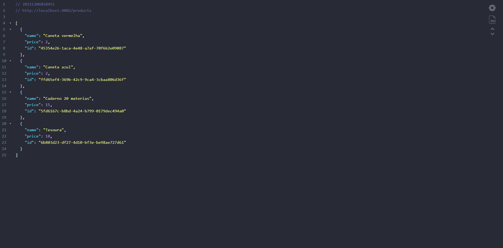

# Primeira API - aprendendo nodeJS

> Lista de produtos de papelaria

Projeto construido utilizando arquivo para armazenamento dos dados  dos produtos.
Implementada funções POST, GET, PUT, DELETE.

[Veja os arquivos do projeto aqui!](https://github.com/Luscv/aprendendo-node-primeiraAPI)

## Tecnologias
- Javascript
- NodeJS
- Postman (para testes de requisição)
- Git e Github

# Contato

lucbarrospc@gmail.com

[LinkedIn](https://www.linkedin.com/in/lucas-barros-8a690a150/)